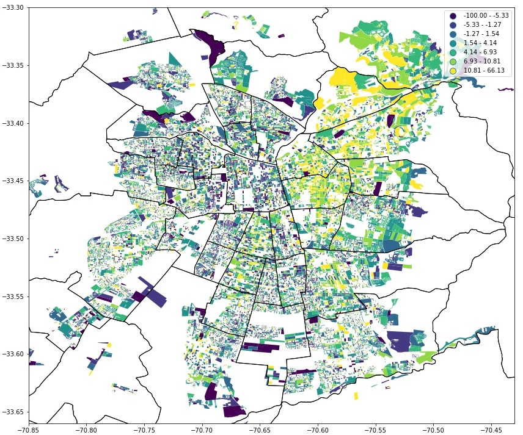
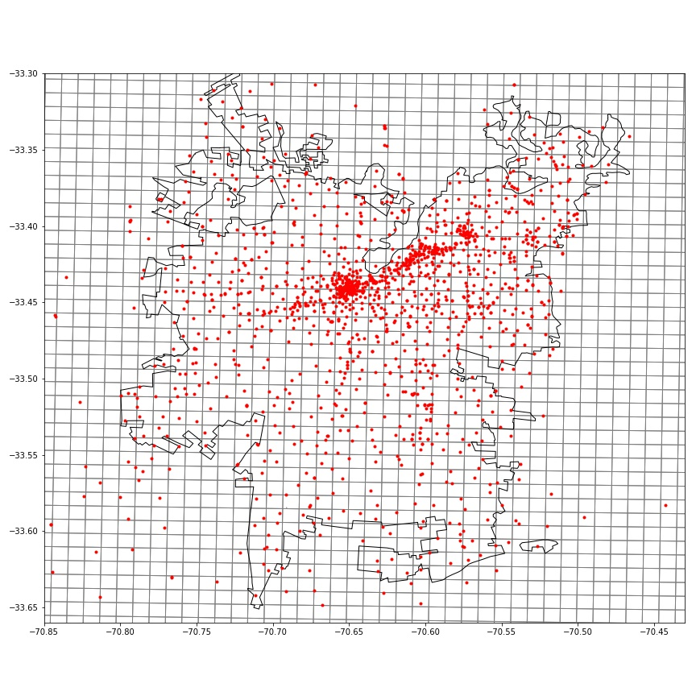
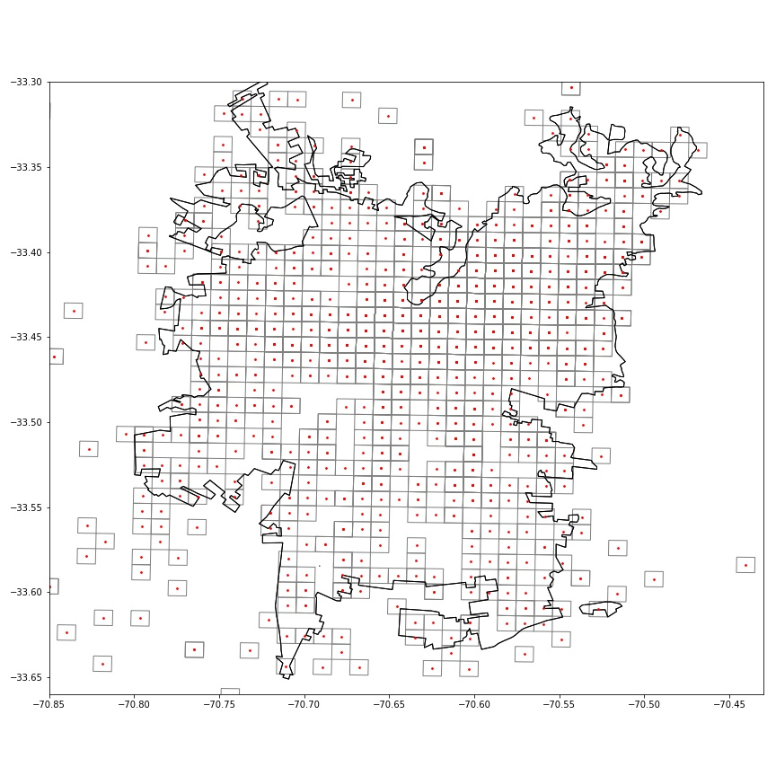
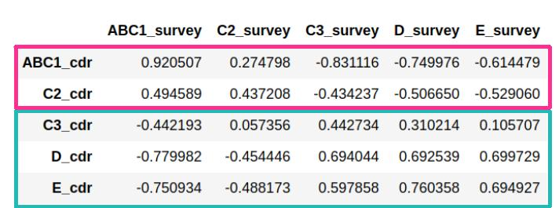
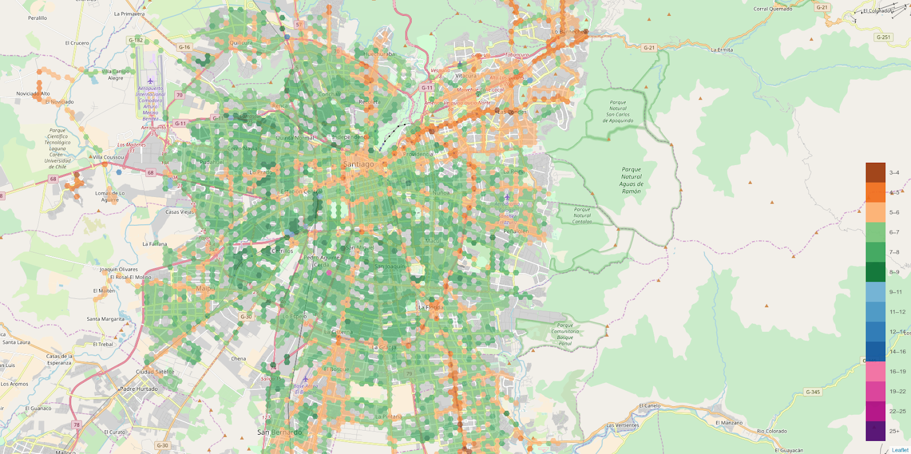
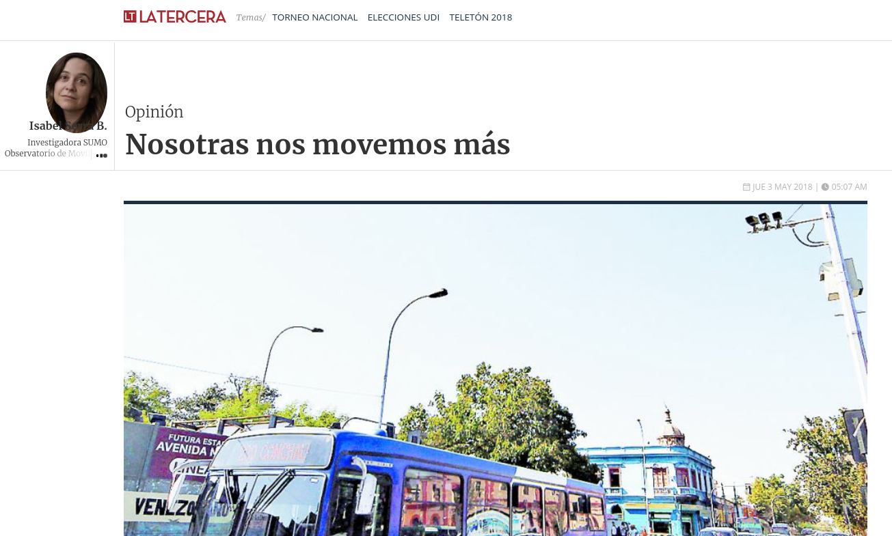
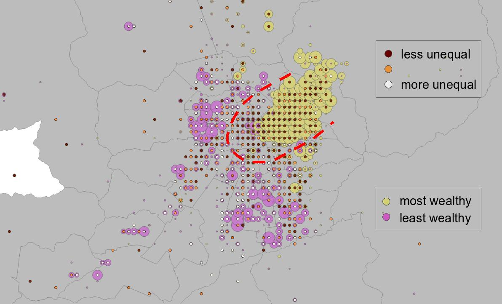
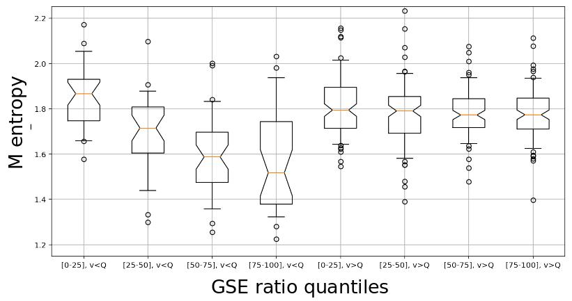
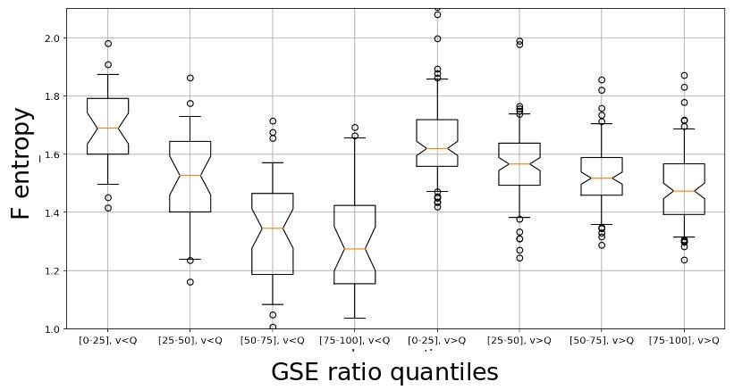

% **Gender Gaps in Urban Mobility**
% **Leo Ferres**\
  @DataScienceUDD & Telefónica R+D, Chile\
  `lferres@udd.cl` | Tw, IG, GH: `@leoferres`
% b: 2018-11-10 11:02:24 -0300 - f: 2018-12-01 13:58:30 -0300\
  EuroCSS 2018, Cologne, Germany

# Motivation

1. Mobility is central to the human species,
2. 68% of the world population will live in cities by 2050 (@UNReport)\footnote{\textcolor[rgb]{0.0,0.0,1.0}{\texttt{\url{https://www.un.org/development/desa/en/news/population/2018-revision-of-world-urbanization-prospects.html}}}}
1. public transportation is central to urban mobility,
1. data inform decisions and policies around the world, including
  mobility,
1.  **\textcolor[rgb]{1.0,0.0,0.0}{most data are not gender
disaggregated}** (@UN, @Data2x)\footnote{\textcolor[rgb]{0.0,0.0,1.0}{\texttt{\url{http://data2x.org}}}}, and
thus gender bias is pervasive,

So, let's **assume** that

- Mobility is a gendered problem (@Law1999, @Rosenbloom2009)\footnote{Our bibliography at
	 \textcolor[rgb]{0.0,0.0,1.0}{\texttt{\url{https://github.com/leoferres/bibliography}}}}.

# How is mobility a gendered problem?

- Women "move less" (Adeel2016),
- Women "move more" (@Psylla2017),
- They "move about the same" (in terms of predictability, @Song2010)

Few large-scale data sets are available.

# Research question

 - **\textcolor[rgb]{0.0,0.0,1.0}{How does access to public transport
   affect women?}**

# Mobility

**Definition**: An individual $i$ "moves more" than an individual $j$
   iff $S^{i} > S^{j}$, where $S$ is Shannon's entropy

 \begin{equation}
 S=-\sum\limits_{l\in L}p_l\ln p_l
 \end{equation}

   over each individual's $i,j$ set of all visited places $L$.

# Santiago de Chile

{height=280px}

# Place

**Definition**: A place $l\in L$ is a 1Km2 cell in a square
grid\footnote{If you'd like to know why I hate Voronois, catch me
after the talk and change my mind.}  where there is at least one Base
Transceiver Station (BTS, fancy for cell tower).

{ height=180px }\ { height=180px }

~1300 cell phone towers, grouped in ~700 spatial clusters, excellent
coverage of Santiago metro area

# Call Detail Records (CDRs)

**Definition**: A CDR $c$ is a tuple $\langle n_a, n_b, l_a, l_b\rangle$, where

 - $n_a$ and $n_b$ are the caller and the callee,
respectively;
 - $l_a$ and $l_b$ are the "in" and "out" towers, respectively, and
 - $t$ is time of call.

In our case, each $c$ has been enriched with:

 - $g_a$, $g_b$, the gender of $n_a$, $n_b$ (binary, male/female),
 - $e_a$, $e_b$, the socio-economic group of $n_a$, $n_b$ (ABC1, C2, C3, D, E)\footnote{See
	 \textcolor[rgb]{0.0,0.0,1.0}{\texttt{\url{https://bit.ly/2Bv0NTI}}}, in Spanish :(},
 - $u$, the number of lines owned by $n_a$.
 - $c_a$, $c_b$ whether "prepaid" or "contract"

# Data: GSE (socio-econ)

{
height=260px }

 - (ABC1, C2)/(C3, D, E), roughly cutting at USD $1000 for C3

# Data: CDRs

We analyzed

- Period:
	- June-August, 2016 (3 months)
	- 2,148,132,995 rows (CDRs, calls), 1.06TB

- Pre-processing, for each (unique) $n$ (in origin and destination):
	- $u = 1$,
	- $g$ and $e$ are not `null`,
	- `events(`$n$`)` > 91, and finally
	- `home(`$n$`)` is not `null`
	- $c$ is "contract"

for a total of **372,152** individuals, **50.9\%** female.

# Data: Public transport (`gtfs.org`)

 - access to public transport
 - number of reachable stations
 - average velocity to reach other nodes in the network

{
height=260px }

# Results: Entropy

{height=250px}

# Meanwhile, in the third most sold Chilean newspaper...

{ height=260px }\

# Results: A gender inequality index

{ height=260px }\

# Results: Effect of access to public transport

{ height=150 }\

{ height=150 }\

# Conclusions

 - Mobility is (strongly) gendered,
 - public transport accessibility affect women different than men,
 - we need a smarter way to think about mobility, particularly when it
   comes to gender, and

BUT...

 - Should policies be implemented?
    - small, incremental,
    - A/B testing when possible,
    - involve social scientists and policy makers early on.

In any case,

 - without data equality, there's no gender equality

# Cast of characters\footnote{{\bf bold} is PI on Data2x}

- **Natalia Adler** (UNICEF)
- **Ciro Cattuto** (ISI Foundation)
- Pablo García (BCI, formerly Telefónica R\& D)
- Laetitia Gauvin (ISI Foundation)
- André Panisson (ISI Foundation)
- Simone Piaggesi (ISI Foundation)
- Michele Tizzoni (ISI Foundation)
- Karim Touma (Fallabela, formerly Telefónica Big Data)
- **Stefaan Verhulst** (The GovLab, NYU)
- Andrew Young (The GovLab, NYU)

**Special gratitude** to all our collaborators at Telefónica Chile,
without whom all these studies would be (_literally_) impossible, and
funding from the United Nations Data2X group.

# **Thank you!**

\

\

# Privacy

It's a common question:

- Numbers are hashed,
- towers are aggregated at the 1Km2 level,
- no reporting of towers with < 3 different (hashed) numbers,
- data do not leave TEF servers (except at very high levels of
  aggregation),
- We **do not** report on (or care about, really) individuals (only
  aggregations).

BUT...

# Privacy

The **\textcolor[rgb]{1.0,0.0,0.0}{uncommon}** question is the
following:

- what are the social costs of **not** doing these studies?
